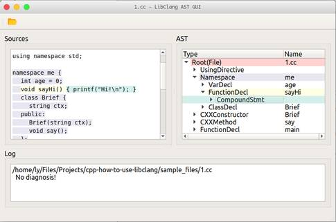

# A Repository About How To Use `libclang`

## Preparation

- `g++`, `LLVM` and `CMake`
- `Qt` (if you want compile gui demo)

## Description

### A simple terminal demo

- sources folder: **src**   
- cmake main file: **CMakeLists.txt**
- expected build target folder: **build**
- build and execute:
	- `mkdir build`
	- `cd build`
	- `cmake ..`
	- `make && ./list-all-children`

### A GUI demo

- sources folder: **gui**
- expected qmake target **build-libclang-gui-...**
- build and execute: open **gui/libclang-gui.pro** in Qt Creator

## References

- Github Repo: [cppit/libclangmm](https://github.com/cppit/libclangmm)
- Font from [iconfont.cn](http://www.iconfont.cn/collections/detail?spm=a313x.7781069.1998910419.d9df05512&cid=1895)

## Author

[LiuYue \<hangxingliu@gmail.com\>](https://github.com/hangxingliu)

## License

[MIT](LICENSE)
